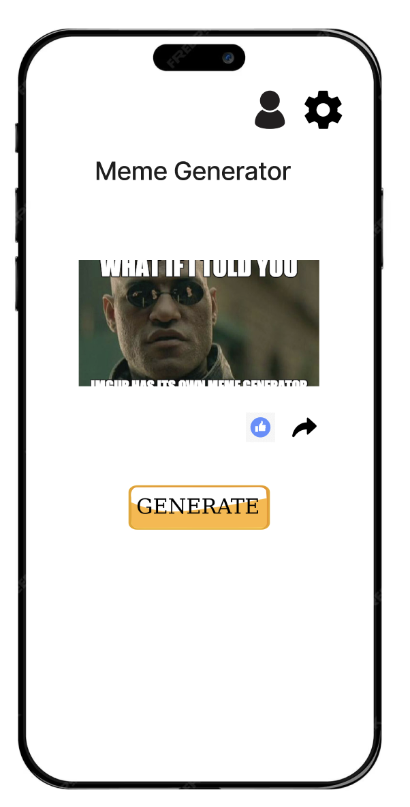
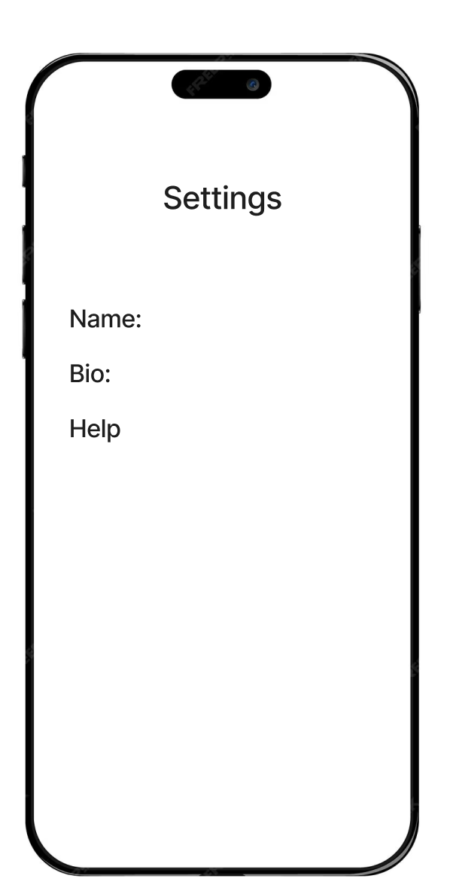

# Meme-rific

    <a href="https://www.loom.com/share/159a52d8bd254e73a6699e93b3713dc1">
      
ericz02/Meme-rific: Meme-rific is a meme generating app that allows users to create memes with their friends and family. - 17 November 2023 - Watch Video

    </a>
    
  

## Table of Contents

1. [Overview](#Overview)
2. [Product Spec](#Product-Spec)
3. [Wireframes](#Wireframes)
4. [Schema](#Schema)

## Overview

### Description

Meme-rific is a meme generating app that allows users to create memes with their friends and family.

### App Evaluation

[Evaluation of your app across the following attributes]
- **Category:**
- **Mobile:**
- **Story:**
- **Market:**
- **Habit:**
- **Scope:**

## Product Spec

### 1. User Stories (Required and Optional)

**Required Must-have Stories**

- User can create a new meme by combining text and an image.
- User can browse a feed of memes created by themselves and others.
- User can like on memes.
- User can share memes on social media platforms.

**Optional Nice-to-have Stories**

- User receives notifications when someone likes or comments on their meme.
- User can explore trending memes.
- User can search for memes based on keywords or categories.
- User can customize the appearance of their profile.
- User can report inappropriate content.

### 2. Screen Archetypes

- Home Feed
  - User can scroll through a feed of memes.

- Create Meme
  - User can create a new meme by adding text to an image.

- Meme Details
  - User can view details, likes, and comments on a specific meme.

### 3. Navigation

**Tab Navigation** (Tab to Screen)

- Home Feed
- Create Meme
- User Profile

**Flow Navigation** (Screen to Screen)

- Home Feed
  - Navigates to Meme Details when a meme is selected.
  - Navigates to User Profile when the user's profile picture is tapped.

- Create Meme
  - Navigates to Home Feed after successfully creating a meme.

- User Profile
  - Navigates to Edit Profile when the user wants to modify their profile.

## Wireframes

[Add picture of your hand-sketched wireframes in this section]

### [BONUS] Digital Wireframes & Mockups

[Include digital wireframes or mockups if available]

### [BONUS] Interactive Prototype

[Include a link to an interactive prototype if available]

## Schema 

[This section will be completed in Unit 9]

### Models

[Add table of models]

### Networking

[Add list of network requests by screen ]
- Create basic snippets for each Parse network request
- [OPTIONAL: List endpoints if using an existing API such as Yelp]
- https://api.imgflip.com/get_memes
